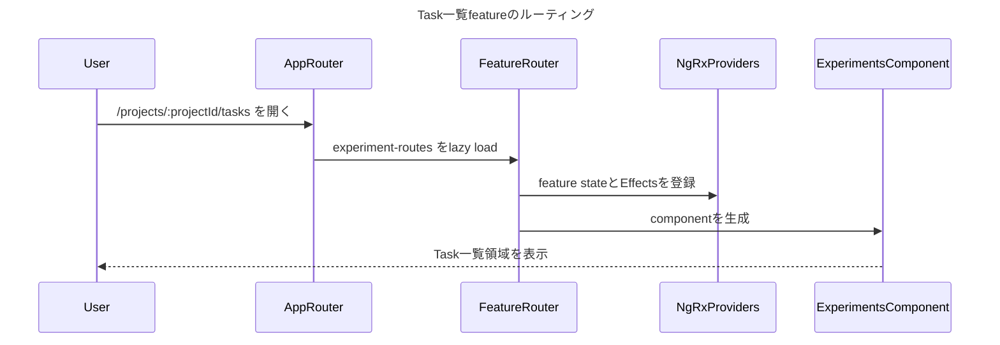
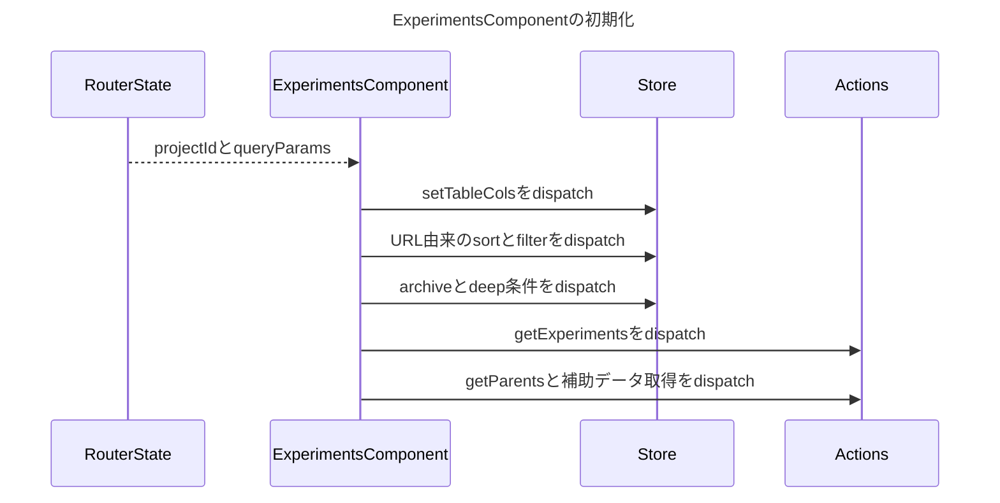
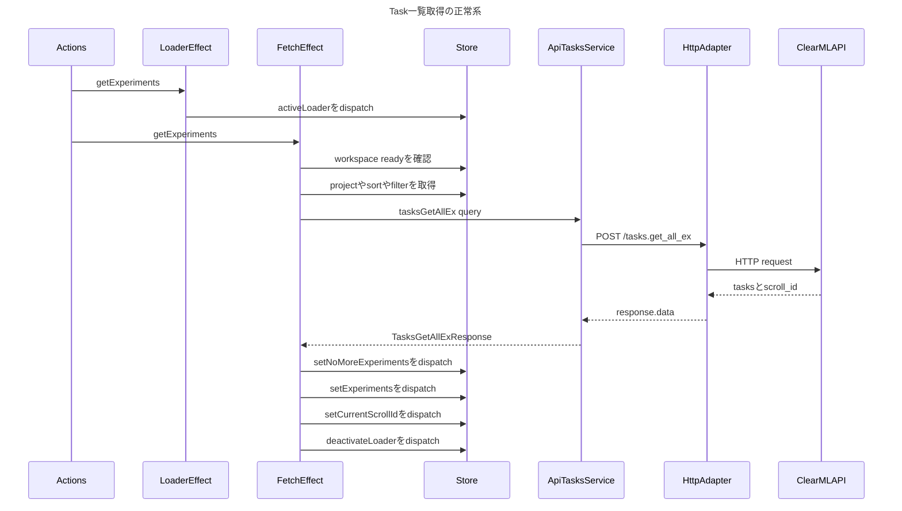
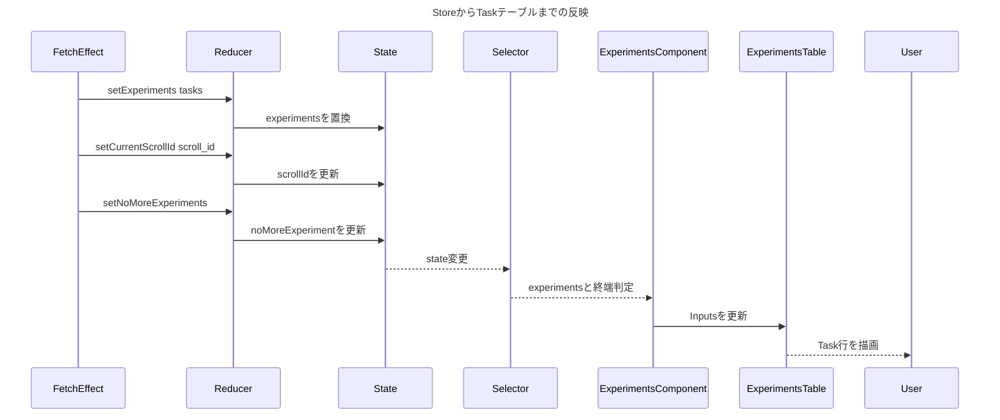
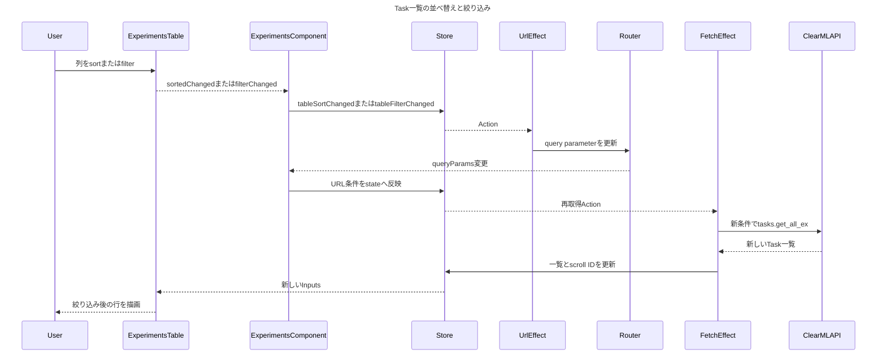
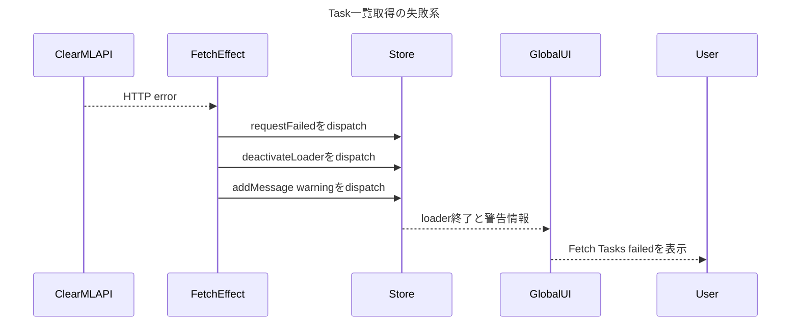

# Task一覧取得・表示のシーケンス図

## 1. このfeatureを最初に選ぶ理由

Task一覧は、ClearML Webで「Experiment」と呼ばれている画面である。
このfeatureでは、大規模Angularアプリの基本的な縦の処理経路を一度に学べる。

```text
Router
  -> Container Component
  -> NgRx Action
  -> Effect + RxJS
  -> API Service + HttpClient
  -> ClearML API
  -> Reducer
  -> Selector
  -> Presentational Component
```

特に重要なのは、画面がAPI Serviceを直接呼ばず、Actionを境界として副作用をEffectへ分離している点である。

対象URLは `/projects/:projectId/tasks`。

## 2. 登場コンポーネントと責務

| 登場要素 | 実装 | 責務 |
| --- | --- | --- |
| Router | `app.routes.ts`、`experiment-routes.ts` | featureをlazy loadし、feature stateとEffectsを提供する |
| Container | `ExperimentsComponent` | URL条件を解釈し、Actionをdispatchし、Selectorの値を画面へ渡す |
| Presentational Component | `ExperimentsTableComponent` | Task一覧を表示し、並べ替え・絞り込み・追加読込をOutputで通知する |
| Action | `common-experiments-view.actions.ts` | UIで起きたことと取得結果を表す |
| Effect | `CommonExperimentsViewEffects` | stateから検索条件を集め、API呼び出しと成功・失敗処理を行う |
| API Client | `ApiTasksService` | `POST /tasks.get_all_ex` を生成する |
| HTTP Adapter | `SmApiRequestsService` | HttpClientを呼び、共通レスポンスの `data` を取り出す |
| Store | `experimentsViewReducer` + selectors | Task一覧、scroll ID、終端判定などを保持・公開する |
| Backend | ClearML API Server | 条件に合うTaskとscroll IDを返す |

## 3. コンポーネント別シーケンス

### 3.1 Router：featureを組み立てる



ここでは二段階のproviderが関係する。親routeの `experimentsProviders` に加え、feature routeの `commonExperimentsProviders` が `EXPERIMENTS_STORE_KEY` のstateと各Effectを登録する。

### 3.2 ExperimentsComponent：初期取得を開始する



`distinctParamsUntilChanged$` はproject IDやquery parameterの変化を監視する。URLの列・並べ替え・filterを先にstateへ反映してから `getExperiments` をdispatchするため、Effectは画面と同じ検索条件をStoreから取得できる。

### 3.3 CommonExperimentsViewEffects：Taskを取得する



Effect内の重要なRxJS operatorは次のとおり。

| operator | この処理での役割 |
| --- | --- |
| `filter` | workspaceの準備が完了するまで取得を進めない |
| `auditTime(50)` | 初期化時に連続する取得契機を50ms単位でまとめる |
| `concatLatestFrom` | Actionを起点に、その時点の検索条件をStoreから集める |
| `switchMap` | 新しい取得契機が来たら古い購読を解除し、古い結果の反映を防ぐ |
| `mergeMap` | 1つのAPI responseを複数の更新Actionへ展開する |
| `catchError` | エラーAction、loader終了、警告通知へ変換する |

### 3.4 ReducerとSelector：responseを表示へ戻す



Containerは `selectExperimentsList` 等を購読し、templateからpresentational componentへ値を渡す。`ExperimentsTableComponent` はStoreやAPI取得の詳細を知らず、Inputの描画とOutputの通知に集中する。

### 3.5 ExperimentsTableComponent：並べ替え・絞り込みを通知する



URLを検索条件の共有可能な表現として使うため、リロードやURL共有でも同じ一覧を再現できる。Componentがその場でAPIを呼ぶ構成とは異なり、URL、Store、API queryの同期が明示されている。

### 3.6 取得失敗：失敗をstate更新へ混ぜない



失敗時には `setExperiments` をdispatchしない。そのため、既存の一覧を空配列で上書きするのではなく、共通エラー処理と通知へ流す。

## 4. 最初に追うファイル

1. `apps/web/src/app/app.routes.ts`
2. `apps/web/src/app/webapp-common/experiments/experiment-routes.ts`
3. `apps/web/src/app/webapp-common/experiments/experiments.component.ts`
4. `apps/web/src/app/webapp-common/experiments/experiments.component.html`
5. `apps/web/src/app/webapp-common/experiments/dumb/experiments-table/experiments-table.component.ts`
6. `apps/web/src/app/webapp-common/experiments/actions/common-experiments-view.actions.ts`
7. `apps/web/src/app/webapp-common/experiments/effects/common-experiments-view.effects.ts`
8. `apps/web/src/app/business-logic/api-services/tasks.service.ts`
9. `apps/web/src/app/business-logic/api-services/api-requests.service.ts`
10. `apps/web/src/app/webapp-common/experiments/reducers/experiments-view.reducer.ts`

## 5. 読解時のチェックポイント

- なぜAPI呼び出しをComponentではなくEffectに置くのか。
- なぜ検索条件をURLとStoreの両方で管理するのか。
- `switchMap` が解除するのはHTTP通信そのものか、responseの購読か。
- `auditTime(50)` がない場合、初期化時に何回取得され得るか。
- `setExperiments`、`setCurrentScrollId`、`setNoMoreExperiments` を分ける利点と欠点は何か。
- API失敗時、前回の一覧を残す現在の動作が要件に合っているか。
- `noMoreExperiment` というstate名と `setNoMoreExperiments` の `hasMore` というpayload名は意味が一致しているか。

## 6. 次に作ると理解がつながる図

次の候補は「Task詳細を選択して右ペインへ表示する処理」。今回の一覧取得に、Router parameter、selected Task、詳細API、子routeが加わるため、同じfeatureを一段深く理解できる。
