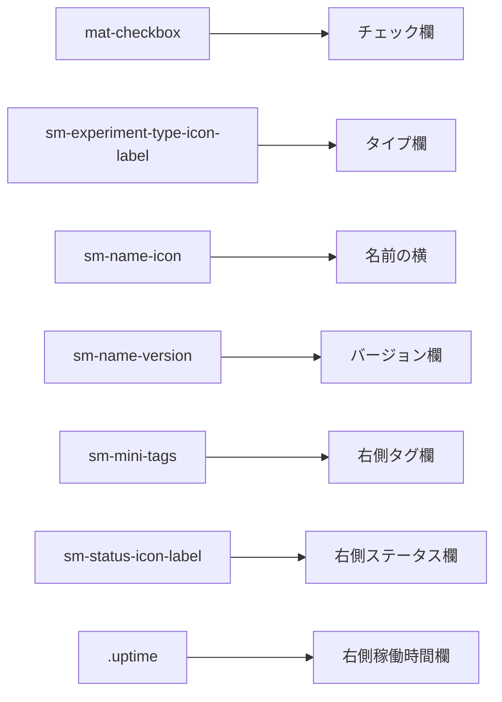
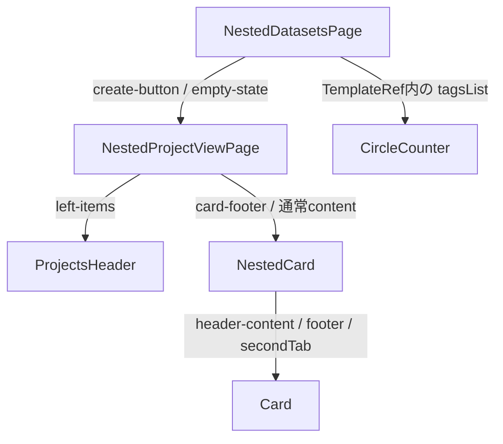

# ClearML Web の `ng-content select` 実使用箇所調査

## 目的

ClearML Web 内の次のような名前付きコンテンツ投影を対象に、差し込み口の定義だけでなく、実際にどこからコンテンツが渡されているかを確認する。

```html
<ng-content select="[extended]"></ng-content>
```

特に、以下を区別する。

- `ng-content select` の定義が存在する
- 対象コンポーネント自体が利用されている
- selector に一致する投影要素が実際に渡されている
- 同名属性はあるが、対象コンポーネントの投影元にはなっていない

調査対象は `src/**/*.html`。`_old` と `node_modules` は除外した。調査時点は 2026-09-13。

---

## 結論

ClearML Web 内には、`select` を持つ名前付き `ng-content` が次の規模で存在する。

| 項目 | 件数 |
|---|---:|
| 名前付きスロットを持つテンプレート | 23 |
| `ng-content select` の定義 | 41 |
| 実際に一致する投影要素があるスロット | 26 |
| 現在一致する投影要素がないスロット | 15 |
| 確認できた投影要素 | 73 |

したがって、`<ng-content select>` 自体は多数あり、その多くは実際に使われている。

一方、最初に調査した Experiment Menu の `[extended]` は、41個のうち「差し込み口はあるが、現在のソース内に投影元がない」15個の側に属する。

```text
ng-content select 全体
├─ 実使用あり: 26スロット
│  ├─ カードレイアウト
│  ├─ テーブルカード
│  ├─ 検索結果
│  ├─ Empty State
│  └─ 操作ボタンなど
└─ 実使用なし: 15スロット
   ├─ Experiment / Model の extended
   ├─ 将来・派生版向けに見える拡張口
   ├─ 利用コンポーネント自体が0件
   └─ 同名属性はあるが直下でない紛らわしい例
```

---

## 調査方法

単なる全文検索だけでは、正しい使用箇所を判定できない。

例えば `extra-buttons` という属性は複数のコンポーネントのスロット名に使われている。また、`empty-state` は通常の CSS class としても多数登場する。

そこで次の順序で照合した。

1. 全 `.component.html` から `ng-content select` を抽出
2. 対応する `.component.ts` の `selector` を特定
3. その selector のコンポーネント利用箇所を検索
4. 利用タグの子コンテンツを Angular Compiler で構文解析
5. 属性・class・要素名がスロット selector と一致するか確認
6. 実使用例は目視でも確認

例えば `[empty-state]` という文字列が別の画面に存在しても、その要素が該当コンポーネントへ渡されていなければ使用扱いにはしていない。

Angular 公式ドキュメントでも、`ng-content` はコンポーネントの子コンテンツを受け取るプレースホルダーであり、`select` は CSS selector に一致する要素を選択するものと説明されている。

- <https://angular.dev/guide/components/content-projection>
- <https://angular.dev/api/core/ng-content>

---

## selector の3形式

ClearML Web では主に3形式が使われている。

### 属性 selector

```html
<ng-content select="[header-buttons]"></ng-content>
```

投影元:

```html
<div header-buttons>...</div>
```

今回の41スロット中35個がこの形式である。

### 要素 selector

```html
<ng-content select="mat-checkbox"></ng-content>
```

投影元:

```html
<mat-checkbox>...</mat-checkbox>
```

該当するのは4個。

- `smTooltipTrigger`
- `mat-checkbox`
- `sm-experiment-type-icon-label`
- `sm-status-icon-label`

### class selector

```html
<ng-content select=".uptime"></ng-content>
```

投影元:

```html
<span class="uptime">...</span>
```

該当するのは2個。

- `.linkToOrigin`
- `.uptime`

`[extended]` と `.extended` は別の selector である点に注意する。

---

## 全41スロットの使用状況

「投影数」は、対象コンポーネントへ selector に一致するルート要素を渡しているソース上の箇所数である。実行時に `@if` の分岐で同時表示されないものも、別の投影記述として数えている。

| 所有コンポーネント | selector | 利用タグ数 | 投影数 | 判定 |
|---|---|---:|---:|---|
| `sm-experiment-info-navbar` | `[refresh]` | 1 | 2 | 使用中 |
| `sm-experiment-menu` / `-extended` | `[extended]` | 2 | 0 | 未使用 |
| `sm-model-menu` / `-extended` | `[extended]` | 2 | 0 | 未使用 |
| `sm-project-card-menu` / `-extended` | `[extendedCardMenu]` | 2 | 0 | 未使用 |
| `sm-dashboard-experiments` | `[header-buttons]` | 1 | 1 | 使用中 |
| `sm-experiment-info-header` | `.linkToOrigin` | 1 | 0 | 未使用 |
| `sm-nested-card` | `[card-footer]` | 1 | 1 | 使用中 |
| `sm-nested-project-view-page` | `[create-button]` | 4 | 4 | 使用中 |
| `sm-nested-project-view-page` | `[extendedButtons]` | 4 | 0 | 未使用 |
| `sm-nested-project-view-page` | `[empty-state]` | 4 | 4 | 使用中 |
| `sm-projects-header` | `[left-items]` | 4 | 3 | 使用中 |
| `sm-markdown-editor` | `[no-data]` | 2 | 2 | 使用中 |
| `sm-multi-line-tooltip` | `smTooltipTrigger` | 5 | 0 | 未使用 |
| `sm-scroll-textarea` | `[empty-state]` | 7 | 0 | 未使用 |
| `sm-scroll-textarea` | `[extra-buttons]` | 7 | 9 | 使用中 |
| `sm-table-card` | `mat-checkbox` | 3 | 2 | 使用中 |
| `sm-table-card` | `sm-experiment-type-icon-label` | 3 | 1 | 使用中 |
| `sm-table-card` | `[sm-name-icon]` | 3 | 2 | 使用中 |
| `sm-table-card` | `[sm-name-version]` | 3 | 1 | 使用中 |
| `sm-table-card` | `[sm-mini-tags]` | 3 | 2 | 使用中 |
| `sm-table-card` | `sm-status-icon-label` | 3 | 2 | 使用中 |
| `sm-table-card` | `.uptime` | 3 | 1 | 使用中 |
| `sm-circle-counter` | `[tagsList]` | 19 | 2 | 使用中 |
| `sm-duration-input-list` | `[after-inputs]` | 4 | 0 | 未使用 |
| `sm-search` | `[infoIcon]` | 13 | 1 | 使用中 |
| `sm-leaf` | `[sm-code]` | 0 | 0 | コンポーネントごと未使用 |
| `sm-wizard-dialog-step` | `[icon]` | 0 | 0 | コンポーネントごと未使用 |
| `sm-wizard-dialog-step` | `[choose-section]` | 0 | 0 | コンポーネントごと未使用 |
| `sm-wizard-dialog-step` | `[buttons-footer]` | 0 | 0 | コンポーネントごと未使用 |
| `sm-card` | `[header-content]` | 8 | 7 | 使用中 |
| `sm-card` | `[headerButtons]` | 8 | 0 | 未使用 |
| `sm-card` | `[footer]` | 8 | 7 | 使用中 |
| `sm-card` | `[secondTab]` | 8 | 3 | 使用中 |
| `sm-card2` | `[extra-header]` | 1 | 1 | 使用中 |
| `sm-card2` | `[header-content]` | 1 | 1 | 使用中 |
| `sm-card2` | `[headerButtons]` | 1 | 1 | 使用中 |
| `sm-card2` | `[footer]` | 1 | 0 | 未使用 |
| `sm-editable-section` | `[extra-buttons]` | 18 | 1 | 使用中 |
| `sm-editable-section` | `[search-button]` | 18 | 1 | 使用中 |
| `sm-menu` | `[fixedOptions]` | 16 | 0 | 未使用判定。後述 |
| `sm-result-line` | `[subtitle]` | 12 | 12 | 使用中 |

---

## 実例1: 最も単純な `[header-buttons]`

スロット定義:

```text
src/app/webapp-common/dashboard/containers/dashboard-experiments/
  dashboard-experiments.component.html:3
```

```html
<div class="recent-header">
  <div class="recent-title">RECENT TASKS</div>
  <ng-content select="[header-buttons]"></ng-content>
</div>
```

投影元:

```text
src/app/features/dashboard/dashboard.component.html:5-15
```

```html
<sm-dashboard-experiments>
  <div header-buttons>
    <button>MANAGE WORKERS AND QUEUES</button>
  </div>
</sm-dashboard-experiments>
```

対応は次の1本だけである。

```text
<div header-buttons>
  ↓ [header-buttons] に一致
<ng-content select="[header-buttons]">
  ↓
RECENT TASKS 見出しの右側に表示
```

これが名前付きコンテンツ投影の基本形である。

---

## 実例2: 1コンポーネントに7スロットある TableCard

`sm-table-card` は、今回最も分かりやすい多スロットの実用例である。

スロット定義:

```text
src/app/webapp-common/shared/ui-components/data/table-card/
  table-card.component.html:10-27
```

```html
<ng-content select="mat-checkbox"></ng-content>
<ng-content select="sm-experiment-type-icon-label"></ng-content>
<ng-content select="[sm-name-icon]"></ng-content>
<ng-content select="[sm-name-version]"></ng-content>
<ng-content select="[sm-mini-tags]"></ng-content>
<ng-content select="sm-status-icon-label"></ng-content>
<ng-content select=".uptime"></ng-content>
```

Experiment Table の投影元:

```text
src/app/webapp-common/experiments/dumb/experiments-table/
  experiments-table.component.html:216-268
```

```html
<sm-table-card>
  <div sm-name-icon>...</div>
  <div sm-name-version>...</div>
  <sm-experiment-type-icon-label ...></sm-experiment-type-icon-label>
  <div sm-mini-tags>...</div>
  <sm-status-icon-label ...></sm-status-icon-label>
  <mat-checkbox ...></mat-checkbox>
</sm-table-card>
```

各要素は、記述順だけで配置されるのではない。selector に対応した別々の位置へ振り分けられる。



利用する画面によって全スロットを埋める必要はない。

- Experiment Table は `.uptime` 以外を主に使用
- Model Table はタイプとバージョン以外を主に使用
- Serving Table は `.uptime` を使用

このように、共通レイアウトを維持したまま、データ種別ごとに必要な断片だけを渡している。

---

## 実例3: `[create-button]` と `[empty-state]`

`sm-nested-project-view-page` は4画面で使われ、両スロットとも4画面すべてで利用されている。

スロット定義:

```text
src/app/webapp-common/nested-project-view/nested-project-view-page/
  nested-project-view-page.component.html:20-21,45
```

利用画面:

| 画面 | `[create-button]` | `[empty-state]` |
|---|---:|---:|
| Feature 側 Dataset | あり | あり |
| Open Dataset | あり | あり |
| Pipeline | あり | あり |
| Report | あり | あり |

Dataset の例:

```html
<sm-nested-project-view-page>
  <button create-button>NEW DATASET</button>

  <div empty-state>
    NO DATASETS TO SHOW
  </div>
</sm-nested-project-view-page>
```

同じページ枠を使いながら、画面ごとに作成ボタンのラベル・click 処理・Empty State を差し替えている。

これは `ng-content select` が有効な典型例である。input だけでは渡しにくい「イベント、アイコン、条件分岐を含むHTML断片」を渡せる。

---

## 実例4: 複数段の投影

Nested Project View 周辺では、投影が1段で終わらない。



例えば `NestedProjectViewPage` は、自分がコンテンツを受け取る側であると同時に、内部で `sm-projects-header` や `sm-nested-card` へコンテンツを渡す側でもある。

```html
<sm-projects-header>
  <sm-button-toggle left-items>...</sm-button-toggle>

  <div>
    <ng-content select="[create-button]"></ng-content>
    <ng-content select="[extendedButtons]"></ng-content>
  </div>
</sm-projects-header>
```

つまり次の2方向が同居している。

```text
外側画面 → NestedProjectViewPage
NestedProjectViewPage → 内側の ProjectsHeader / NestedCard
```

「どの `ng-content` に入るか」を調べるときは、最も近い利用タグだけでなく、そのコンポーネントの内部テンプレートも追う必要がある。

---

## 実例5: `[extra-buttons]` は所有者を確認する

`[extra-buttons]` は次の2コンポーネントがスロットとして定義している。

```text
sm-scroll-textarea
sm-editable-section
```

Experiment Execution には、両方が入れ子になっている箇所がある。

```html
<sm-editable-section>
  <sm-scroll-textarea>
    <button extra-buttons>EDIT</button>
    <button extra-buttons>DISCARD DIFFS</button>
  </sm-scroll-textarea>
</sm-editable-section>
```

この2ボタンの投影先は `sm-scroll-textarea` である。`sm-editable-section` のスロットではない。

一方、次のボタンは `sm-editable-section` の直接のコンテンツなので、そちらへ投影される。

```html
<sm-editable-section>
  <button extra-buttons>RESET ALL</button>
  ...
</sm-editable-section>
```

同じ属性名だけを全文検索すると、この違いを見落とす。

今回の判定結果:

| 所有者 | 実際の投影数 |
|---|---:|
| `sm-scroll-textarea [extra-buttons]` | 9 |
| `sm-editable-section [extra-buttons]` | 1 |

---

## 実例6: `[subtitle]` は12種類の検索結果で共通利用

`sm-result-line` は Dashboard Search の検索結果行に使われる。

```html
<div class="sub-title">
  <ng-content select="[subtitle]"></ng-content>
</div>
```

利用側は次の形式で字幕部分を渡す。

```html
<sm-result-line ...>
  <ng-container subtitle>
    <span class="project">...</span>
    <span class="sub-item">...</span>
  </ng-container>
</sm-result-line>
```

確認できた12種類:

- Dataview
- Model
- Model Endpoint
- Open Dataset
- Open Dataset Version
- Pipeline
- Pipeline Run
- Project
- Queue
- Report
- Route
- Task

共通行コンポーネントが外枠を持ち、entity ごとの差分だけを `[subtitle]` で受け取る設計である。

---

## 実例7: `[no-data]` で空表示を差し替える

`sm-markdown-editor` は、表示データがないときに次のスロットを表示する。

```html
@else {
  <ng-content select="[no-data]"></ng-content>
}
```

投影元は2件ある。

- `project-info.component.html`
- `report.component.html`

Project Info の例では、アイコン、説明、編集開始ボタンを含む一式を渡している。

```html
<sm-markdown-editor ...>
  <div no-data>
    <i class="al-ico-no-data-markdown"></i>
    <div>THERE’S NOTHING HERE YET…</div>
    <button (click)="editor.editClicked()">ADD PROJECT OVERVIEW</button>
  </div>
</sm-markdown-editor>
```

このような複数要素とイベント処理を伴う UI は、単純な文字列 input よりコンテンツ投影に向いている。

---

## 未使用15スロットの分類

### A. コンポーネントは利用中だが、スロットが空

| スロット | 状況 |
|---|---|
| Experiment Menu `[extended]` | Extended を含め利用タグ2件、投影元0件 |
| Model Menu `[extended]` | Extended を含め利用タグ2件、投影元0件 |
| Project Card Menu `[extendedCardMenu]` | 利用タグ2件、投影元0件 |
| Experiment Info Header `.linkToOrigin` | 利用タグ1件、投影元0件 |
| Nested Project View `[extendedButtons]` | 利用タグ4件、投影元0件 |
| Multi Line Tooltip `smTooltipTrigger` | 利用タグ5件、該当要素0件 |
| Scroll Textarea `[empty-state]` | 利用タグ7件、投影元0件 |
| Duration Input List `[after-inputs]` | 利用タグ4件、投影元0件 |
| Card `[headerButtons]` | 利用タグ8件、投影元0件 |
| Card2 `[footer]` | 利用タグ1件、投影元0件 |

これらは「ただちに不要」とは断定できない。

共通 UI や `...ExtendedComponent` のスロットは、別エディション、派生版、将来機能などから利用する拡張ポイントである可能性がある。ただし、現在の調査対象ソース内では使われていない、という事実までは確認できる。

### B. 所有コンポーネント自体の利用が0件

| コンポーネント | スロット |
|---|---|
| `sm-leaf` | `[sm-code]` |
| `sm-wizard-dialog-step` | `[icon]` |
| `sm-wizard-dialog-step` | `[choose-section]` |
| `sm-wizard-dialog-step` | `[buttons-footer]` |

この4スロットは、現在の HTML テンプレート内で所有コンポーネントの利用自体を確認できなかった。

### C. `[fixedOptions]` は同名属性があるが、投影構造が異なる

`sm-menu` は次のスロットを持つ。

```html
<div #refFixedOptions>
  <ng-content select="[fixedOptions]"></ng-content>
</div>
```

一方、`table-filter-sort.component.html` には確かに次の記述がある。

```html
<sm-menu>
  ...
  <div class="options-section">
    ...
    <div fixedOptions>...</div>
  </div>
</sm-menu>
```

しかし `[fixedOptions]` の `<div>` は `sm-menu` のルート子ではなく、`options-section` の内側にある。

`ng-content select` は、コンポーネントへ渡された子コンテンツをスロットへ振り分ける。子孫要素を DOM 検索のように掘って回収する機能ではない。この構造では、外側の `options-section` がデフォルトの `<ng-content>` へ投影され、その内側の `[fixedOptions]` だけが別スロットへ移動するわけではない。

したがって今回の監査では、`[fixedOptions]` スロットの実使用とは数えていない。

意図どおり Fixed Options 欄へ投影したい場合の構造は、概念的には次のようになる。

```html
<sm-menu>
  <div class="options-section">通常オプション</div>
  <div fixedOptions>固定オプション</div>
</sm-menu>
```

これは今回の調査で見つかった、全文検索だけでは判断を誤りやすい代表例である。

---

## Experiment Menu `[extended]` の位置づけを再確認

スロット:

```html
<ng-content select="[extended]"></ng-content>
```

所有 selector:

```text
sm-experiment-menu
sm-experiment-menu-extended
```

利用箇所:

```text
src/app/webapp-common/experiments/experiments.component.html:141-161
src/app/webapp-common/experiments/dumb/experiment-info-header/
  experiment-info-header.component.html:85-99
```

どちらも次の形で、タグ内に子要素がない。

```html
<sm-experiment-menu-extended
  ...
></sm-experiment-menu-extended>
```

そのため、`ExperimentMenuExtendedComponent` が継承によって機能していることと、`[extended]` スロットが使われていることは別である。

```text
ExperimentMenuExtendedComponent の継承
  → 使用中

共通HTMLの [extended] 投影スロット
  → 現在は未使用
```

ただし、ClearML Web 全体でコンテンツ投影が形だけ残っているわけではない。TableCard、Nested Project View、ResultLine などでは中核的なレイアウト手段として活用されている。

---

## 実コードを読むおすすめ順

### 入門: 1スロット・1利用元

1. `dashboard-experiments.component.html`
2. `dashboard.component.html`

`[header-buttons]` の1対1対応だけを確認する。

### 次: 複数スロット

1. `table-card.component.html`
2. `experiments-table.component.html:216-268`

要素が selector ごとに別の場所へ振り分けられる様子を確認する。

### 次: 再利用性

1. `result-line.component.html`
2. `dashboard-search/search-result-*/**.component.html`

12種類の entity が同じ `[subtitle]` 契約を使う様子を確認する。

### 発展: 多段構造

1. `nested-datasets-page.component.html`
2. `nested-project-view-page.component.html`
3. `nested-card.component.html`
4. `card.component.html`

受け取り側だったコンポーネントが、さらに内側コンポーネントへコンテンツを渡す構造を追う。

### 注意例

1. `menu.component.html:51,62`
2. `table-filter-sort.component.html:23-91`

デフォルトスロット、名前付きスロット、要素の直接の親子関係を確認する。

---

## 最終まとめ

```text
ClearML Web の ng-content select
  定義: 41
  実使用あり: 26
  実使用なし: 15
  投影元として確認できた記述: 73
```

学習上の重要点は次の4つである。

1. `select` は CSS selector として働く
2. コンポーネント利用タグの子コンテンツが投影対象になる
3. 同じ属性名でも、どのコンポーネントの子かによって投影先が変わる
4. 差し込み口の定義があっても、現在の利用側が何も渡していない場合がある

Experiment Menu の `[extended]` は未使用例だが、ClearML Web 全体では `ng-content select` は実際に広く利用されている。特に TableCard、Nested Project View、ResultLine は、コンテンツ投影を学ぶ題材として分かりやすい。
