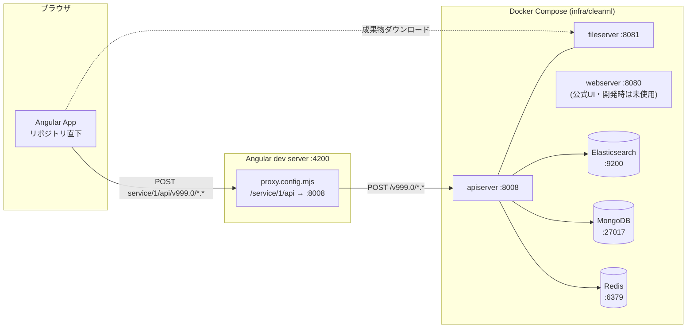
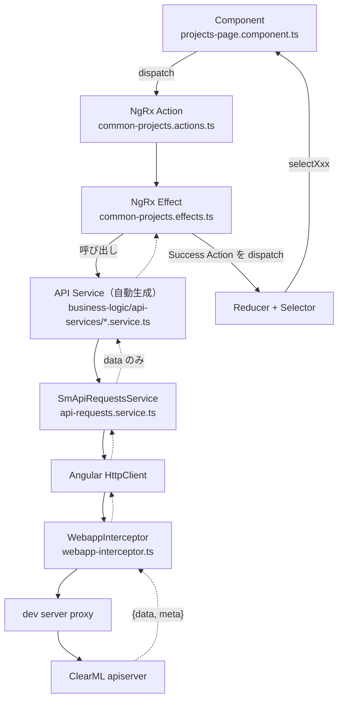
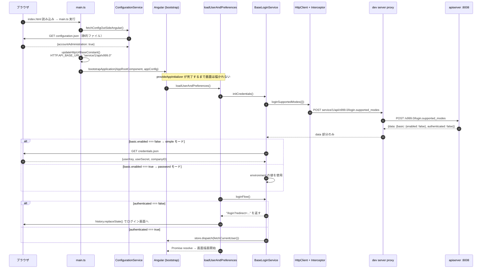
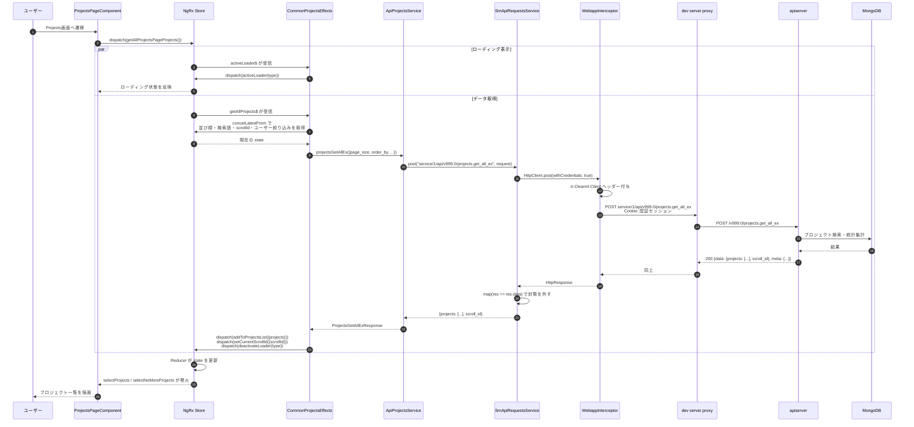
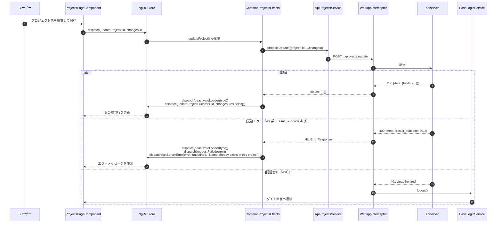
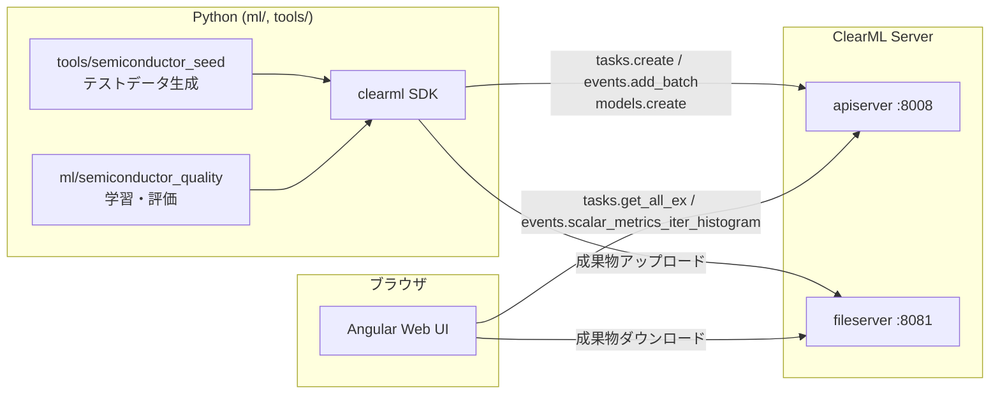

# Angular画面・API通信・バックエンドの接続解説

作成日: 2026-09-15
対象: リポジトリ直下のAngular 22版 ClearML Webと `infra/clearml`（ClearML Server 2.4.0）

## この資料が扱う範囲

ブラウザ上のAngularコンポーネントで起きた操作が、どの層を通ってClearML ServerのAPIへ届き、どう画面へ戻るのかを追う。層ごとの責務、URLが組み立てられる仕組み、認証の成立過程、エラー時の分岐を、実際のファイルを挙げながら説明する。

読み終えると、次の三つが分かる。

- 画面のボタンを押してから画面が更新されるまでに通過する層と、各層のファイル
- `service/1/api` という相対URLが `http://localhost:8008` に届くまでの変換
- ブラウザ起動直後に認証が成立するまでの順序

---

## 1. 全体構成

開発時は、Angular dev server（4200番）がAPIリクエストをプロキシとして中継し、ClearML Serverのapiserver（8008番）へ転送する。



apiserverの背後にある三つのストアは役割が分かれている。MongoDBがプロジェクト・タスク・モデルといったエンティティ本体を、Elasticsearchがスカラーやログなどの時系列イベントを、Redisがセッションとキューの状態を保持する。`compose.yaml` ではこの三つを `internal: true` の `backend` ネットワークに置いているため、ホストからは直接触れない。ブラウザから到達できるのはapiserverとfileserverだけである。

Angularアプリは別の経路でも動く。`webserver`（8080番）は公式ビルド済みUIを配信するコンテナで、本プロジェクトの開発中は使わない。開発では4200番のdev serverを使い、プロキシ経由で同じapiserverに接続する。

---

## 2. APIのURLが組み立てられる仕組み

Angular側のコードはどこにもホスト名を書かない。`projects.service.ts` が組み立てるのは `service/1/api/v999.0/projects.get_all` という**相対URL**である。この文字列が4段階で作られる。

### 2.1 四つの構成要素

| 段階 | 値 | 定義場所 |
|---|---|---|
| ベースURL | `service/1/api` | `src/environments/environment.ts` |
| APIバージョン | `/v999.0` | `src/app/app.constants.ts` の `ENVIRONMENT.API_VERSION` |
| 連結結果 | `service/1/api/v999.0` | `updateHttpUrlBaseConstant()` が `HTTP.API_BASE_URL` に代入 |
| エンドポイント | `/projects.get_all` | 各APIサービスのメソッド内 |

[environment.ts](src/environments/environment.ts) は開発用の設定で、`apiBaseUrl` に `service/1/api` を持つ。本番用の [environment.prod.ts](src/environments/environment.prod.ts) は `apiBaseUrl` を持たないため、`updateHttpUrlBaseConstant()` 内の `guessAPIServerURL()` が現在のオリジンから `:8008` を推測する。

連結は [app.constants.ts:97](src/app/app.constants.ts#L97) の `updateHttpUrlBaseConstant()` で行われ、結果がモジュールスコープの可変オブジェクト `HTTP` に書き込まれる。各APIサービスはコンストラクタで `HTTP.API_BASE_URL` を `basePath` に読み取るため、この関数はAngularのbootstrapより前に呼ばれていなければならない。[main.ts](src/main.ts) が `bootstrapApplication()` の直前に呼んでいるのはそのためである。

### 2.2 プロキシによる転送

`service/1/api` という接頭辞自体には意味がなく、プロキシに転送先を選ばせるための目印として働く。[proxy.config.mjs](proxy.config.mjs) が `targets` 配列を走査し、添字に応じて `/service/1/api`、`/service/2/api` … というパスを生成して、それぞれ別のバックエンドへ割り当てる。現状は転送先が `http://localhost:8008` の一つだけなので、生成されるのは `/service/1/api` のみである。

```javascript
const targets = ['http://localhost:8008'];   // 添字0 → /service/1/api
```

`pathRewrite` が接頭辞を空文字へ置換するため、最終的な変換はこうなる。

```text
ブラウザ:    POST /service/1/api/v999.0/projects.get_all
              ↓ proxy.config.mjs (pathRewrite: ^/service/1/api → '')
apiserver:   POST http://localhost:8008/v999.0/projects.get_all
```

`changeOrigin: true` と `cookieDomainRewrite: 'localhost'` も指定されている。後者は、apiserverが返す認証Cookieのドメインを `localhost` へ書き換え、ポートが違うdev server経由でもブラウザがCookieを保持できるようにする。

### 2.3 ClearML API の呼び出し規約

ClearML APIはRESTではない。三つの規約がある。

- すべてPOSTで呼ぶ。読み取り系の `projects.get_all` もPOSTである。
- エンドポイント名は `<サービス名>.<アクション名>` の形をとる（`projects.get_all`、`tasks.update`、`auth.login`）。
- レスポンスは `{data, meta}` の封筒に包まれる。`data` が本体、`meta` が結果コードなどを持つ。

封筒の型は [api-request.ts](src/app/business-logic/model/api-request.ts) の `SmHttpResponse` として定義され、`data` の取り出しは共通層が担当する（後述）。

---

## 3. 層の構成と責務

画面からバックエンドまでの通り道は、次の層に分かれる。



各層の責務は次のとおり。

**Component** は状態を持たない。ユーザー操作をActionに変換して `store.dispatch()` し、表示データはSelectorから受け取る。[projects-page.component.ts](src/app/webapp-common/projects/containers/projects-page/projects-page.component.ts) は `selectProjects` などのSelectorを購読し、スクロールや検索の操作を `getAllProjectsPageProjects` などのActionへ変換する。

**Effect** が副作用の唯一の置き場である。Actionを受けてAPIサービスを呼び、結果を成功Actionまたは失敗Actionへ変換して戻す。Effectはプロジェクトの規約で更新対象stateのfeature配下に置く。

**API Service** はOpenAPI Generatorによる自動生成コードで、`business-logic/api-services/` に17ファイルある（`projects`、`tasks`、`models`、`events`、`auth`、`users` など）。各メソッドはAcceptヘッダーやContent-Typeを組み立てて `SmApiRequestsService.post()` を呼ぶだけで、ここを手で編集することはない。

**SmApiRequestsService** が共通処理を引き受ける。[api-requests.service.ts:38](src/app/business-logic/api-services/api-requests.service.ts#L38) の `post()` は、`withCredentials: true` を強制したうえで、`map(res => res.data)` により `{data, meta}` 封筒から `data` を取り出す。上位のEffectが封筒を意識しなくて済むのはこの一行のためである。

**WebappInterceptor** はHTTPリクエスト全体に横断的な処理を挿す。[webapp-interceptor.ts](src/app/webapp-common/core/interceptors/webapp-interceptor.ts) は `X-Clearml-Client: Webapp-<version>` ヘッダーを付与し、レスポンスが401なら（ログイン画面にいる場合を除いて）`login.logout()` を呼ぶ。登録は [app.config.ts:72](src/app/app.config.ts#L72) の `HTTP_INTERCEPTORS` プロバイダで行う。

### パスエイリアスと features / webapp-common の使い分け

TypeScriptのパスエイリアスは2種類ある（[tsconfig.json:26](tsconfig.json#L26)）。

- `~/*` → `src/app/*`
- `@common/*` → `src/app/webapp-common/*`

`webapp-common` がClearML共通実装、`features` が本プロジェクト固有の差分という分担になっている。`@features/projects/projects-page.utils` のように `~` 経由でfeatures側を参照している箇所は、共通実装からプロジェクト固有の振る舞いを呼び出す差し替え点である。

---

## 4. 起動シーケンス：認証が成立するまで

画面が描かれる前に、設定の取得と認証を終える必要がある。この工程は `main.ts` の即時実行関数と `provideAppInitializer` の二段構えになっている。



### 各ステップの補足

**設定ファイルの二重構造。** `configuration.json` はビルド成果物に含まれる静的ファイルで、現状は `accountAdministration: true` の一項目だけを持つ。この仕組みにより、再ビルドせずに配置先で挙動を変えられる。`main.ts` はこれを `environment` にマージしてから `updateHttpUrlBaseConstant()` へ渡す。

**ログインモードの分岐。** [login.service.ts:140](src/app/webapp-common/shared/services/login.service.ts#L140) の `calcLoginMode()` が `login.supported_modes` の応答を見て決める。`basic.enabled` が真ならパスワード認証（`password`）、偽なら `loginFallback` 設定に従って `simple` か `error` になる。本プロジェクトの開発環境は `simple` に落ちる。

**開発用の固定資格情報。** `simple` モードでは `credentials.json` を取得し、そこに書かれた `userKey` / `userSecret` を Basic 認証ヘッダーの素材にする。この値は `compose.yaml` の `CLEARML__secure__credentials__tests__user_key` / `__user_secret` と一致しており、apiserver側にシステムロールの認証情報として仕込まれている。両者が揃うことでパスワード入力なしにログインが通る。

この資格情報はブラウザへ配信されるため、開発環境の外で使うわけにはいかない。`compose.yaml` のコメントも同じ注意を明記している。

**API呼び出しを伴わない認証判定。** `authenticated` フラグは `login.supported_modes` の応答に含まれており、`loginFlow()` はこの値だけを見てログイン画面へ飛ばすか判断する。追加のAPI呼び出しは発生しない。

**初期化完了の待ち合わせ。** `loadUserAndPreferences()` はPromiseを返し、`provideAppInitializer` がこれを待つ。この完了前にAPIサービスが呼ばれると `HTTP.API_BASE_URL` が空のままリクエストが飛ぶため、順序の保証が必要になる。

---

## 5. 画面操作からデータ表示まで（読み取り系）

Projects画面を開いてプロジェクト一覧を取得する流れを追う。読み取り系の代表例である。



### 読み取りどころ

**Effectは一つのActionを複数のEffectが受ける。** `getAllProjectsPageProjects` は `activeLoader$` と `getAllProjects$` の両方が `ofType` で拾う。ローディング表示とデータ取得が独立したEffectに分かれているため、どちらかを変えても他方に影響しない。

**リクエストパラメータはStoreから集める。** Componentは「取得せよ」というActionを投げるだけで、ページサイズや並び順は渡さない。[common-projects.effects.ts:68](src/app/webapp-common/projects/common-projects.effects.ts#L68) の `getAllProjects$` が `concatLatestFrom` で `selectProjectsOrderBy`、`selectProjectsSearchQuery`、`selectProjectsScrollId`、`selectCurrentUser` などをまとめて読み、リクエストを組み立てる。並び替えや検索の操作は、対応するActionでstateを書き換えてから同じ取得Actionを投げれば済む。

**ページングは `scroll_id` で行う。** apiserverが返す `scroll_id` をstateへ保存し、次の取得時に送り返すカーソル方式である。offsetではないため、取得中に件数が変わっても重複や取りこぼしが起きにくい。

**`switchMap` の採用理由。** `getAllProjects$` は `switchMap` を使う。検索語を続けて入力すると取得Actionが連続して飛ぶが、`switchMap` は新しいリクエストが来た時点で前のリクエストを破棄するため、古い応答が後から届いて一覧を上書きする事態を防ぐ。

---

## 6. 更新系とエラーハンドリング

プロジェクト名の変更を例に、更新系と失敗時の分岐を見る。



### 三層のエラー処理

エラーは処理される場所が三段に分かれている。

**インターセプター層（横断）。** 401はどのAPI呼び出しでも起こりうるため、個々のEffectではなくインターセプターが一括で処理する。ログイン画面と`/signup`にいる場合は除外する（未ログイン状態での401は正常な応答であり、そこで `logout()` を呼ぶと無限ループになる）。

**Effect層（業務エラー）。** ClearML APIは業務上の失敗を `meta.result_subcode` の数値で区別する。[common-projects.effects.ts:60](src/app/webapp-common/projects/common-projects.effects.ts#L60) は `800` を「名前が3文字未満」、`801` を「同名のプロジェクトが既に存在する」と読み替え、`setServerError` に人が読める文言を渡す。サブコードの意味はエンドポイントごとに異なるため、この読み替えは呼び出し側のEffectに置くしかない。

**共通Action（記録）。** `requestFailed` は失敗をStoreに流す共通Actionである。[http.actions.ts](src/app/webapp-common/core/actions/http.actions.ts) の定義では、`HttpErrorResponse` から `headers` を除き、`error` プロパティも `meta` だけに絞ってからstateへ渡す。認証トークンなどの機微情報をStoreやDevToolsに残さないための措置である。

**失敗時もローディングを必ず解除する。** 成功側・失敗側のどちらの分岐でも `deactivateLoader(action.type)` を発行している。片方で忘れると、エラー後にスピナーが回り続ける。

---

## 7. データ取得のトリガー

ここまでの通信が何をきっかけに始まるのかを要約する。詳細は [03_データ取得トリガーとポーリング機構](03_データ取得トリガーとポーリング機構.md) を参照。

WebSocketもServer-Sent Eventsも使っていない。サーバーからの能動的な通知はなく、取得はすべてブラウザ側から始まる。きっかけは5系統ある。

| # | きっかけ | 実装 |
|---|---|---|
| ① | 画面を開く | コンポーネント初期化・ルートパラメータの変更 |
| ② | ユーザー操作 | 検索・並び替え・フィルタ・無限スクロール |
| ③ | 自動更新（10秒） | `RefreshService` がアプリ全体で単一の `interval` を持つ |
| ④ | 手動更新ボタン | `RefreshButtonComponent` から同じtickへ流す |
| ⑤ | 更新成功後の再取得 | ダイアログ確定・作成完了 |

自動更新は AUTO REFRESH トグル（既定はオン）とタブの表示状態の両方が真のときだけ発火する。Workers / Queues 画面だけは `RefreshService` を経由せず、独自の30秒 `interval` を持つ。

`tick` は `null`（自動）、`false`（手動）、`true`（変更確認済み）の3値を流し分ける。自動tickではまず `last_change` だけを取りに行き、値が進んでいた場合に限ってログやスカラーを取得する二段構えになっている。

---

## 8. ClearML SDK との関係

Angular画面が読むデータは、Python側から投入される。両者はapiserverを共有するだけで、直接は通信しない。



Python SDKが `tasks.create` や `events.add_batch` で書き込んだものを、Angular側が `tasks.get_all_ex` などで読み出す。エンドポイント名の規約と `{data, meta}` 封筒はどちらの経路でも共通で、違いはクライアント側の実装言語だけである。学習ログのようなイベント系はElasticsearchに、タスクやモデルのメタデータはMongoDBに入る。

成果物（モデルファイル、アーティファクト）はapiserverを通らず、fileserverへ直接アップロード・ダウンロードされる。Angular側の `HTTP.FILE_BASE_URL` と `ConfigurationService.fileServerUrl` がこの向き先を保持する。

---

## 9. 変更時に触る場所

| やりたいこと | 触るファイル |
|---|---|
| 転送先バックエンドを増やす・変える | [proxy.config.mjs](proxy.config.mjs) の `targets` 配列 |
| APIのベースURLを変える | [environment.ts](src/environments/environment.ts) の `apiBaseUrl` |
| 全リクエストに共通ヘッダーを足す | [webapp-interceptor.ts](src/app/webapp-common/core/interceptors/webapp-interceptor.ts) |
| 新しいAPIエンドポイントを呼ぶ | 該当する `business-logic/api-services/*.service.ts`（自動生成）を確認し、Effectから呼ぶ |
| 副作用（API呼び出し）を追加する | 更新対象stateのfeature配下に `*.effects.ts` を置く |
| 開発用の認証情報を変える | `credentials.json` と `infra/clearml/compose.yaml` の `CLEARML__secure__credentials__tests__*` を**両方**揃える |
| 再ビルドなしで挙動を切り替える | [configuration.json](src/configuration.json) |

認証情報は2箇所に分かれているため、片方だけ変えるとログインが通らなくなる。

---

## 付録: 主要ファイル一覧

**設定・起動**

- [proxy.config.mjs](proxy.config.mjs) — dev serverのAPI転送設定
- [src/environments/environment.ts](src/environments/environment.ts) — 開発時の `apiBaseUrl`
- [src/environments/base.ts](src/environments/base.ts) — `Environment` 型と既定値
- [src/main.ts](src/main.ts) — bootstrap前の設定読み込みとURL確定
- [src/app/app.constants.ts](src/app/app.constants.ts) — `HTTP` 定数と `updateHttpUrlBaseConstant()`
- [src/app/app.config.ts](src/app/app.config.ts) — プロバイダ登録（インターセプター、初期化処理）
- [src/app/core/app-init.ts](src/app/core/app-init.ts) — 設定・認証の初期化

**通信層**

- [src/app/business-logic/api-services/api-requests.service.ts](src/app/business-logic/api-services/api-requests.service.ts) — 共通POSTと封筒の展開
- [src/app/webapp-common/core/interceptors/webapp-interceptor.ts](src/app/webapp-common/core/interceptors/webapp-interceptor.ts) — ヘッダー付与と401処理
- [src/app/business-logic/model/api-request.ts](src/app/business-logic/model/api-request.ts) — `{data, meta}` 封筒の型
- [src/app/webapp-common/shared/services/login.service.ts](src/app/webapp-common/shared/services/login.service.ts) — ログインモード判定と認証

**画面と状態管理（Projectsの例）**

- [src/app/webapp-common/projects/containers/projects-page/projects-page.component.ts](src/app/webapp-common/projects/containers/projects-page/projects-page.component.ts)
- [src/app/webapp-common/projects/common-projects.effects.ts](src/app/webapp-common/projects/common-projects.effects.ts)
- [src/app/webapp-common/projects/common-projects.actions.ts](src/app/webapp-common/projects/common-projects.actions.ts)
- [src/app/webapp-common/projects/common-projects.reducer.ts](src/app/webapp-common/projects/common-projects.reducer.ts)
- [src/app/core/effects/users.effects.ts](src/app/core/effects/users.effects.ts) — `fetchCurrentUser` の処理

**バックエンド**

- [infra/clearml/compose.yaml](infra/clearml/compose.yaml) — ClearML Server 一式の構成
