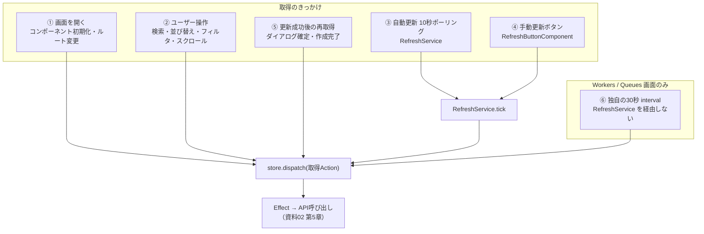
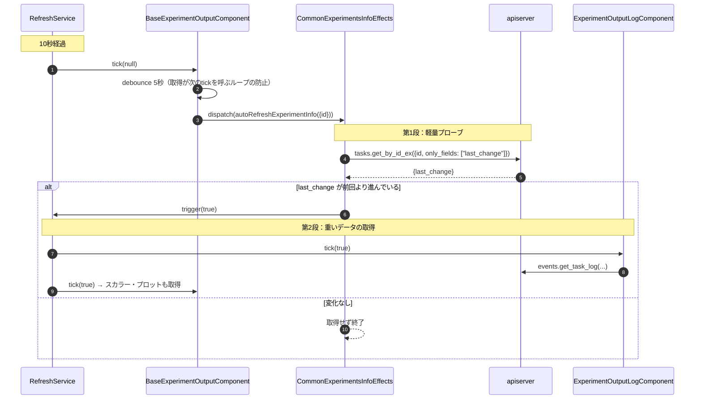

# データ取得トリガーとポーリング機構

作成日: 2026-09-15
対象: `apps/web`（Angular 22版 ClearML Web）
関連資料: [02_Angular画面とAPI通信とバックエンドの接続解説](02_Angular画面とAPI通信とバックエンドの接続解説.md)

## この資料が扱う範囲

Web UIが表示するデータは、何をきっかけに取りに行くのかを扱う。資料02が「どの層をどう通るか」を追ったのに対し、こちらは「いつ始まるか」を追う。取得が始まったあとの層の通り方は02の第5章を参照してほしい。

読み終えると、次の三つが分かる。

- サーバーからのプッシュを使っていない理由と、代わりに何をしているか
- 10秒ポーリングが動く条件と、止まる条件
- 実行中でないタスクの画面を開きっぱなしにしても通信量が膨らまない仕組み

---

## 1. プッシュを使わない

WebSocketもServer-Sent Eventsも使っていない。`package.json` にsocket系の依存はなく、`WebSocket` や `EventSource` を呼ぶコードもソース中に存在しない。サーバーからの能動的な通知は一切なく、取得はすべてブラウザ側から始まる。

きっかけは5系統あり、Workers / Queues 画面だけが別系統をもう一つ持つ。



以降、この6系統を順に見る。

---

## 2. 画面を開いたとき

コンポーネントの初期化時に一度だけ取得する。Projects画面の場合、[projects-page.component.ts:139](apps/web/src/app/webapp-common/projects/containers/projects-page/projects-page.component.ts#L139) が `selectActiveWorkspaceReady` を `take(1)` で待ってから `getAllProjectsPageProjects()` を投げる。ワークスペースの初期化完了を待つのは、それ以前だとリクエストに必要なユーザー情報が揃っていないためである。

ルートのパラメータが変わったときも取得し直す。同じコンポーネントのまま別プロジェクトへ遷移する場合、Angularはコンポーネントを再生成しないため、`selectedProject$` を `distinctUntilKeyChanged('id')` で購読して差分を検出する。

---

## 3. ユーザー操作

検索語の入力、並び順の変更、タグやユーザーによる絞り込みは、いずれも「stateを書き換えてから取得Actionを投げる」形をとる。Effectがリクエストパラメータを `concatLatestFrom` でStoreから読む設計のため、パラメータを引数で渡す必要がない。

一覧下端までのスクロールは `loadMore()` が `getAllProjectsPageProjects()` を投げ、Effectが保存済みの `scroll_id` を添えて続きを取得する。

---

## 4. 自動更新（10秒ポーリング）

[refresh.service.ts](apps/web/src/app/webapp-common/core/services/refresh.service.ts) がアプリ全体で一つの `interval` を持つ。周期は `app.constants.ts` の `AUTO_REFRESH_INTERVAL`（10秒）である。

```typescript
interval(AUTO_REFRESH_INTERVAL)
  .pipe(
    withLatestFrom(
      this.store.select(selectAutoRefresh),
      this.store.select(selectAppVisible)
    ),
    filter(([, auto, visible]) => auto && visible)
  )
  .subscribe(() => this._tick.next(null));
```

二つの条件を満たしたときだけ発火する。

- `selectAutoRefresh` — 更新ボタンのメニューにある AUTO REFRESH トグルの状態。既定値は `true`（[view.reducer.ts:55](apps/web/src/app/webapp-common/core/reducers/view.reducer.ts#L55)）なので、何もしなければ自動更新は動いている。
- `selectAppVisible` — [app.component.ts:76](apps/web/src/app/app.component.ts#L76) の `document:visibilitychange` ハンドラが更新する値。タブが裏に回っている間はポーリングを止める。

各画面はこの単一のtickを購読する。画面ごとにタイマーを持たないため、複数のパネルを同時に開いても取得の波は10秒ごとに一度で揃う。

---

## 5. 手動更新ボタン

[refresh-button.component.ts](apps/web/src/app/webapp-common/shared/components/refresh-button/refresh-button.component.ts) の `refresh()` が `refreshService.trigger()` を呼び、同じtickに流し込む。自動と手動が同じ配管を通るので、購読側は購読を一つ持てば両方に対応できる。ボタンにホバーすると AUTO REFRESH トグルと REFRESH ボタンのメニューが開く。

---

## 6. tickが運ぶ3つの値

`tick` は `Subject<boolean>` だが、`null` を含む3値を流し分けており、購読側はこの値で処理を変える。

| 値 | 発生源 | 意味 |
|---|---|---|
| `null` | 10秒interval | 自動tick。まず変更の有無を確かめる |
| `false` | `trigger()`（更新ボタン） | 手動更新。無条件で取得する |
| `true` | `trigger(true)`（Effect内） | 変更が確認された、という通知 |

`true` を流すのはEffectだけである。この3値目があるおかげで、重いデータの取得を二段構えにできる。実験詳細画面を例にとる。



第1段では `only_fields: ['last_change']` を指定してタイムスタンプ1個だけを取りに行く。値が前回から進んでいなければ、ログもスカラーもプロットも取得しない。実行中でないタスクの詳細画面を開きっぱなしにしても、10秒ごとに飛ぶのは数十バイトのプローブだけである。

ログ画面の購読条件がこれを裏づけている（[experiment-output-log.component.ts:130](apps/web/src/app/webapp-common/experiments/containers/experiment-output-log/experiment-output-log.component.ts#L130)）。

```typescript
filter(autoRefresh => autoRefresh !== null && ...)
```

`null`（素の自動tick）を除外し、`false`（手動）と `true`（変更確認済み）にだけ反応する。一方、一覧画面を束ねる [base-entity-page.ts:142](apps/web/src/app/webapp-common/shared/entity-page/base-entity-page.ts#L142) は逆に `!tick` で `null` と `false` を通し、`true` を除外する。プローブを起点とするカスケードで一覧まで再取得してしまうのを防ぐためである。

### tickのループを断つdebounce

実験詳細画面の購読には `debounce(auto => auto === false ? interval(0) : interval(5000))` が挟まっている。取得処理が `trigger(true)` を呼び、それがまた取得を呼ぶ循環を止めるための措置で、手動更新（`false`）だけは遅延ゼロで即座に通す。

---

## 7. 自動更新と手動更新の見え方の違い

一覧画面の `refreshList(isAutoRefresh)` は、受け取った値をそのまま `hideLoader` に渡す。

```typescript
refreshList(isAutoRefresh: boolean) {
  this.store.dispatch(experimentsActions.refreshExperiments({
    hideLoader: isAutoRefresh,
    autoRefresh: isAutoRefresh
  }));
}
```

自動更新ではスピナーを出さない。10秒ごとに画面がちらつくのを避けるためで、ユーザーが明示的にボタンを押したときだけローディング表示が出る。

編集中は自動更新を止める仕組みもある。`base-entity-page.ts` の購読は編集モードのフラグを `concatLatestFrom` で読み、立っていればtickを捨てる。入力途中の値がサーバーの値で上書きされるのを防ぐ。

---

## 8. Workers / Queues 画面の例外

この2画面だけは `RefreshService` を使わず、コンポーネント内に独自の `interval` を持つ。周期は30秒（`REFRESH_INTERVAL = 30000`）で、[workers.component.ts:48](apps/web/src/app/webapp-common/workers-and-queues/containers/workers/workers.component.ts#L48) と `queues.component.ts` にそれぞれ定義されている。グラフ表示の `workers-stats` / `queue-stats` はさらに別で、ユーザーが選んだ時間粒度（granularity）を秒数として `interval` に渡す。

これらは AUTO REFRESH トグルにもタブの表示状態にも連動しない。トグルを切ってもワーカー一覧の更新は止まらず、タブを裏に回してもポーリングは続く。

---

## 9. 挙動の一覧

| 画面・状況 | 周期 | AUTO REFRESHトグルで止まる | タブを裏に回すと止まる |
|---|---|---|---|
| 一覧画面（Projects / Tasks / Models） | 10秒 | 止まる | 止まる |
| 実験詳細（ログ・スカラー・プロット） | 10秒（プローブ）＋変更時のみ本取得 | 止まる | 止まる |
| 編集モード中の一覧画面 | 取得しない | — | — |
| Workers / Queues 一覧 | 30秒 | **止まらない** | **止まらない** |
| Workers / Queues グラフ | 選択した粒度 | **止まらない** | **止まらない** |

---

## 10. 変更時に触る場所

| やりたいこと | 触るファイル |
|---|---|
| 自動更新の周期を変える | `app.constants.ts` の `AUTO_REFRESH_INTERVAL` |
| 自動更新の既定値をオフにする | [view.reducer.ts:55](apps/web/src/app/webapp-common/core/reducers/view.reducer.ts#L55) の `autoRefresh` |
| Workers / Queues の周期を変える | 各コンポーネント内の `REFRESH_INTERVAL` 定数（2箇所） |
| 新しい画面を自動更新に乗せる | `RefreshService.tick` を購読し、tickの3値の扱いを決める |
| 自動更新を止める条件を足す | `refresh.service.ts` の `filter`、または購読側の `filter` |

周期の定数は `AUTO_REFRESH_INTERVAL` と `REFRESH_INTERVAL`（2ファイル）に分かれているため、全画面の周期を揃えたい場合は3箇所を直す。

---

## 付録: 主要ファイル一覧

**ポーリングの中核**

- [apps/web/src/app/webapp-common/core/services/refresh.service.ts](apps/web/src/app/webapp-common/core/services/refresh.service.ts) — 単一のintervalとtickの発行
- [apps/web/src/app/webapp-common/shared/components/refresh-button/refresh-button.component.ts](apps/web/src/app/webapp-common/shared/components/refresh-button/refresh-button.component.ts) — 手動更新とトグル
- [apps/web/src/app/webapp-common/core/reducers/view.reducer.ts](apps/web/src/app/webapp-common/core/reducers/view.reducer.ts) — `selectAutoRefresh` / `selectAppVisible`
- [apps/web/src/app/app.component.ts](apps/web/src/app/app.component.ts) — `visibilitychange` の監視

**tickの購読側**

- [apps/web/src/app/webapp-common/shared/entity-page/base-entity-page.ts](apps/web/src/app/webapp-common/shared/entity-page/base-entity-page.ts) — 一覧画面の共通基底
- [apps/web/src/app/webapp-common/experiments/containers/experiment-ouptut/base-experiment-output.component.ts](apps/web/src/app/webapp-common/experiments/containers/experiment-ouptut/base-experiment-output.component.ts) — 実験詳細のtick処理とdebounce
- [apps/web/src/app/webapp-common/experiments/containers/experiment-output-log/experiment-output-log.component.ts](apps/web/src/app/webapp-common/experiments/containers/experiment-output-log/experiment-output-log.component.ts) — ログ取得
- [apps/web/src/app/webapp-common/experiments/effects/common-experiments-info.effects.ts](apps/web/src/app/webapp-common/experiments/effects/common-experiments-info.effects.ts) — 軽量プローブと `trigger(true)`
- [apps/web/src/app/webapp-common/experiments-compare/effects/compare-header-effects.ts](apps/web/src/app/webapp-common/experiments-compare/effects/compare-header-effects.ts) — 比較画面のプローブ

**独自interval**

- [apps/web/src/app/webapp-common/workers-and-queues/containers/workers/workers.component.ts](apps/web/src/app/webapp-common/workers-and-queues/containers/workers/workers.component.ts)
- [apps/web/src/app/webapp-common/workers-and-queues/containers/queues/queues.component.ts](apps/web/src/app/webapp-common/workers-and-queues/containers/queues/queues.component.ts)
