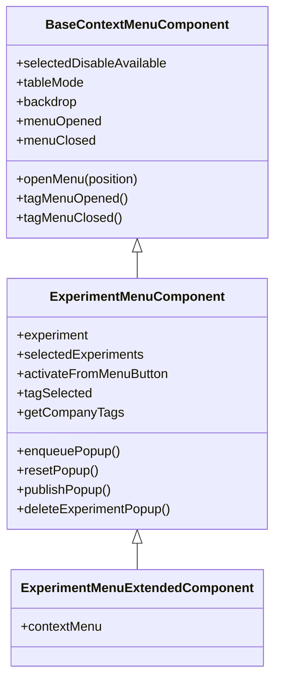
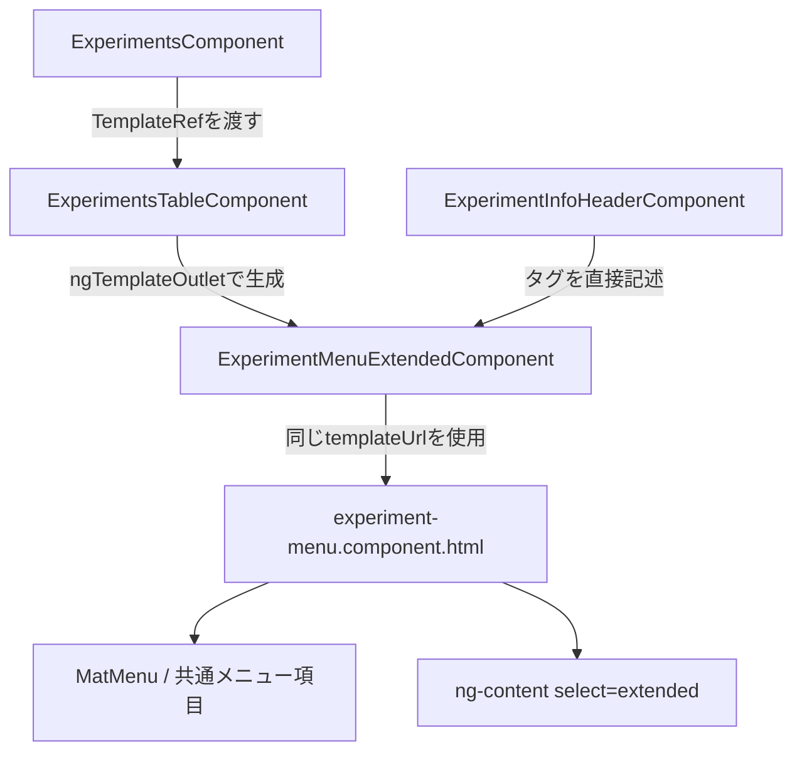
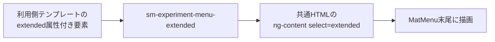

# ExperimentMenuExtendedComponent と `ng-content[extended]` の関係

## この資料の目的

次の3つを混同せずに理解することを目的とする。

1. TypeScript のクラス継承
2. Angular テンプレート上のコンポーネント包含関係
3. `<ng-content>` によるコンテンツ投影

対象は主に次のファイルである。

- `src/app/webapp-common/shared/components/base-context-menu/base-context-menu.component.ts`
- `src/app/webapp-common/experiments/shared/components/experiment-menu/experiment-menu.component.ts`
- `src/app/webapp-common/experiments/shared/components/experiment-menu/experiment-menu.component.html`
- `src/app/features/experiments/containers/experiment-menu-extended/experiment-menu-extended.component.ts`
- `src/app/webapp-common/experiments/experiments.component.{ts,html}`
- `src/app/webapp-common/experiments/dumb/experiments-table/experiments-table.component.{ts,html}`
- `src/app/webapp-common/experiments/dumb/experiment-info-header/experiment-info-header.component.{ts,html}`

調査時点は 2026-09-13、使用中の Angular は `^22.1.5` である。

---

## 最初に結論

`ExperimentMenuExtendedComponent` は、TypeScript 上では `ExperimentMenuComponent` を継承している。

```text
BaseContextMenuComponent
  └─ ExperimentMenuComponent
       └─ ExperimentMenuExtendedComponent
```

一方、次の記述はクラス継承とは別の仕組みである。

```html
<ng-content select="[extended]"></ng-content>
```

これは、`<sm-experiment-menu-extended>...</sm-experiment-menu-extended>` の開始タグと終了タグの間に渡された要素のうち、`extended` 属性を持つものを、その位置に表示するための「差し込み口」である。

したがって、両者の関係は次のようになる。

```text
クラス継承
  → ExtendedComponent がメニューの状態・入力・出力・処理を引き継ぐ

同一 templateUrl の指定
  → ExtendedComponent も共通の experiment-menu.component.html を描画する

共通HTML内の ng-content[extended]
  → 利用側から追加要素が渡された場合だけ、その要素を末尾に差し込む
```

重要なのは、`ExperimentMenuExtendedComponent` のクラス自体が `<ng-content>` に何かを自動挿入するわけではない、という点である。

さらに、現在のリポジトリ内には `extended` 属性を付けた投影要素が存在しない。つまり現状の `<ng-content select="[extended]">` は、実行時には空の差し込み口である。

---

## 「親子関係」は1種類ではない

このコードを読むときは、「親」という言葉が何を指すかを明確にする必要がある。

| 観点 | 親 | 子 | 実際の関係 |
|---|---|---|---|
| TypeScript 継承 | `BaseContextMenuComponent` | `ExperimentMenuComponent` | 基本的なコンテキストメニュー機能を継承 |
| TypeScript 継承 | `ExperimentMenuComponent` | `ExperimentMenuExtendedComponent` | Experiment メニューの全機能を継承 |
| Angular 利用関係 | `ExperimentsComponent` | `ExperimentMenuExtendedComponent` | テーブル画面用メニューを生成・操作 |
| Angular 利用関係 | `ExperimentInfoHeaderComponent` | `ExperimentMenuExtendedComponent` | 詳細ヘッダー内にメニューボタンを表示 |
| HTML 投影 | `ExperimentMenuExtendedComponent` の利用側 | `[extended]` 要素 | 利用側が子要素をスロットへ提供 |

`ExperimentMenuComponent` と `ExperimentMenuExtendedComponent` の間には TypeScript の親子関係がある。しかし画面上で `<sm-experiment-menu>` の内側に `<sm-experiment-menu-extended>` が入れ子になっているわけではない。

実際には `sm-experiment-menu-extended` が、自分自身のビューとして共通 HTML を直接描画する。

---

## 全体俯瞰図

### 1. クラスの継承鎖



数珠つなぎの深さは、対象の Extended Component までで3クラスである。

### 2. テンプレートの利用関係



### 3. `<ng-content>` が使われた場合の投影関係



この3つの図は、それぞれ別の関係を表している。

---

## 段階1: 最上位の BaseContextMenuComponent

`BaseContextMenuComponent` は継承鎖の最上位にある。

定義箇所:

```text
src/app/webapp-common/shared/components/base-context-menu/base-context-menu.component.ts:20
```

主な責務は次のとおり。

- NgRx `Store` とホスト要素 `ElementRef` の注入
- 選択項目ごとの有効・無効情報を受け取る input
- テーブル表示かどうか、Backdrop を使うかなどの input
- `menuOpened`、`menuClosed` output
- 右クリック位置を保持する `position` signal
- `MatMenuTrigger` を使った `openMenu()`
- タグメニューの開始・終了処理
- コンポーネント外クリック時のメニュー終了処理

特に `openMenu()` は、右クリック座標を保存し、非表示のトリガー位置を更新して Material Menu を開く処理である。

```ts
openMenu(position: { x: number; y: number}) {
  // 既存メニューを閉じる
  // position signal を更新する
  // MatMenuTrigger の位置を更新して開く
}
```

この機能は、下位2クラスにも継承される。

---

## 段階2: ExperimentMenuComponent

`ExperimentMenuComponent` は `BaseContextMenuComponent` を継承する。

定義箇所:

```text
src/app/webapp-common/experiments/shared/components/experiment-menu/experiment-menu.component.ts:97
```

```ts
export class ExperimentMenuComponent extends BaseContextMenuComponent {
  // Experiment 固有の input、output、状態、操作
}
```

ここで Experiment 固有の機能が大量に追加される。

代表的な input:

- `experiment`
- `selectedExperiment`
- `selectedExperiments`
- `numSelected`
- `activateFromMenuButton`
- `useCurrentEntity`
- `isCompare`
- `minimizedView`
- `projectTags` / `companyTags`

代表的な output:

- `tagSelected`
- `getCompanyTags`

代表的な操作:

- enqueue / retry / dequeue
- reset / abort / abort all children
- publish / archive / delete
- clone / move project
- queue・worker への移動
- export

したがって、メニューの実体となるロジックの大半はこのクラスにある。

### テンプレート

`@Component` は次の共通 HTML と SCSS を指定している。

```ts
@Component({
  selector: 'sm-experiment-menu',
  templateUrl: './experiment-menu.component.html',
  styleUrls: ['./experiment-menu.component.scss'],
  // ...
})
```

共通 HTML の中心は `mat-menu` であり、各ボタンから上記メソッドを呼び出す。

---

## 段階3: ExperimentMenuExtendedComponent

定義は非常に短い。

```text
src/app/features/experiments/containers/experiment-menu-extended/experiment-menu-extended.component.ts:11-29
```

```ts
@Component({
  selector: 'sm-experiment-menu-extended',
  templateUrl: '../../../../webapp-common/experiments/shared/components/experiment-menu/experiment-menu.component.html',
  styleUrls: ['../../../../webapp-common/experiments/shared/components/experiment-menu/experiment-menu.component.scss'],
  imports: [/* 共通HTMLに必要な依存 */]
})
export class ExperimentMenuExtendedComponent extends ExperimentMenuComponent {
  contextMenu = computed(() => this as ExperimentMenuComponent);
}
```

このクラスが行っていることは、現在は主に次の3点である。

1. 別の selector、`sm-experiment-menu-extended` を公開する
2. `ExperimentMenuComponent` のフィールドとメソッドをすべて継承する
3. 自分自身を `ExperimentMenuComponent` として返す `contextMenu` computed を公開する

### テンプレートは「継承された」のではなく、明示的に再指定されている

ここは重要である。

`extends ExperimentMenuComponent` と書いたから共通 HTML が自動採用されているのではない。Extended 側の `@Component` が、同じ HTML ファイルを `templateUrl` として明示的に指定している。

```text
ExperimentMenuComponent
  templateUrl ─┐
               ├─ 同じ experiment-menu.component.html
Extended       ┘
  templateUrl
```

また、共通 HTML のコンパイルに必要な Material コンポーネントや Pipe なども、Extended 側の `imports` に明示されている。

### `contextMenu` の意味

```ts
contextMenu = computed(() => this as ExperimentMenuComponent);
```

これは別の `ExperimentMenuComponent` インスタンスを生成していない。返されるのは同じ `ExperimentMenuExtendedComponent` インスタンスである。

```ts
extended.contextMenu() === extended // 概念上 true
```

型だけを親クラスの `ExperimentMenuComponent` として見せる窓口になっている。

`ExperimentsComponent` は次のようにその窓口を使う。

```ts
contextMenuExtended = viewChild.required(ExperimentMenuExtendedComponent);
public contextMenu = computed(() => this.contextMenuExtended().contextMenu());
```

その後は `this.contextMenu().openMenu(...)` や `resetPopup()` など、親クラス由来の共通 API を呼び出している。

---

## 段階4: `<ng-content select="[extended]">` の正体

対象箇所:

```text
src/app/webapp-common/experiments/shared/components/experiment-menu/experiment-menu.component.html:136
```

```html
<ng-content select="[extended]"></ng-content>
```

`ng-content` は Angular のコンテンツ投影スロットである。Web Components の `<slot>` に近い役割と考えると理解しやすい。

`select="[extended]"` は CSS セレクター形式であり、「`extended` 属性を持つ要素だけ」を受け入れる。

例えば利用側が次のように書いたとする。

```html
<sm-experiment-menu-extended
  [experiment]="experiment"
  [selectedDisableAvailable]="availability"
>
  <button extended mat-menu-item (click)="runSpecialAction()">
    Special action
  </button>
</sm-experiment-menu-extended>
```

すると `button` は、共通 HTML 内の次の位置へ投影される。

```html
<button mat-menu-item data-id="exportTaskButton" (click)="exportTask()">
  Export
</button>

<!-- ここに Special action の button が入る -->
<ng-content select="[extended]"></ng-content>
```

このスロットは `mat-menu` の中、共通項目の末尾にあるため、追加項目もメニュー末尾へ入る。

### 投影される要素の式は誰のコンテキストで評価されるか

投影要素は利用側テンプレートに書かれている。そのため、上の `runSpecialAction()` は `ExperimentMenuExtendedComponent` ではなく、利用側コンポーネントのメソッドを参照する。

つまり次の2つは異なる。

```text
共通HTML内の (click)="resetPopup()"
  → ExperimentMenuExtendedComponent が継承した resetPopup() を呼ぶ

投影要素内の (click)="runSpecialAction()"
  → その要素を書いた利用側コンポーネントの runSpecialAction() を呼ぶ
```

### 現状は何が投影されているか

何も投影されていない。

現在確認できる利用箇所は次の2つで、どちらも開始・終了タグ間が空である。

```text
src/app/webapp-common/experiments/experiments.component.html:141-161
src/app/webapp-common/experiments/dumb/experiment-info-header/experiment-info-header.component.html:85-99
```

したがって現在の描画は、概念的には次のようになる。

```html
<ng-content select="[extended]"></ng-content>
<!-- 該当要素なし → 何も描画しない -->
```

`extended` という単語がクラス名とスロット名の両方にあるため連動して見えるが、Angular の機構として自動的な接続はない。

---

## 段階5: 実際の利用元は2系統

### 系統A: Experiments 一覧の右クリックメニュー

この系統は TemplateRef を別コンポーネントへ渡すため、最も数珠つなぎが長い。

#### 生成まで

```text
1. ExperimentsComponent の HTML が ng-template を宣言
2. その TemplateRef を contextMenuTemplate input で ExperimentsTableComponent に渡す
3. ExperimentsTableComponent が ngTemplateOutlet でテンプレートを生成
4. テンプレート内の sm-experiment-menu-extended が生成される
5. ExtendedComponent が共通 experiment-menu.component.html を描画
```

対応箇所:

```text
experiments.component.html:94
  [contextMenuTemplate]="contextMenuExtendedTemplate"

experiments.component.html:140-162
  <ng-template #contextMenuExtendedTemplate let-contextExperiment>
    <sm-experiment-menu-extended ...>

experiments-table.component.html:1
  *ngTemplateOutlet="contextMenuTemplate(); context: {$implicit: contextExperiment()}"
```

`let-contextExperiment` には、テーブル側の `$implicit: contextExperiment()` が入る。

#### 右クリックして開くまで

```text
ExperimentsTableComponent.openContextMenu()
  ↓ contextMenu output を座標付きで emit
ExperimentsComponent.onContextMenuOpen()
  ↓
this.contextMenu().openMenu({x, y})
  ↓ 継承元
BaseContextMenuComponent.openMenu()
  ↓
MatMenuTrigger.openMenu()
```

対応箇所:

```text
experiments-table.component.ts:349-362
experiments.component.ts:735-739
base-context-menu.component.ts:48-59
```

この実行経路はイベントとメソッド呼び出しを数えると、おおむね5段階である。

#### フッター操作からの経路

一覧下部のフッターメニューも、同じ Extended Component の実体を操作窓口として再利用する。

```text
EntityFooter の footerItemClick
  ↓
ExperimentsComponent.onFooterHandler()
  ↓
this.contextMenu().resetPopup() など
  ↓
ExperimentMenuComponent から継承した処理
```

`contextMenu()` は「右クリック UI を開くためだけのもの」ではなく、共通の操作ロジックを呼ぶ窓口にもなっている。

### 系統B: Experiment 詳細ヘッダーのメニューボタン

こちらは単純である。

```text
ExperimentInfoHeaderComponent
  ↓ 直接配置
sm-experiment-menu-extended
  ↓ 共通HTML
ボタン + MatMenu
```

対応箇所:

```text
experiment-info-header.component.html:84-100
experiment-info-header.component.ts:61
```

この場合は `activateFromMenuButton` のデフォルト値が `true` なので、共通 HTML 冒頭のメニューボタンが表示される。

一覧側では `[activateFromMenuButton]="false"` を渡しているため、ボタンではなく座標指定用の非表示トリガーが使われる。

つまり同じクラス・同じ HTML が、input によって次の2用途を兼ねる。

| 利用場所 | `activateFromMenuButton` | 開き方 |
|---|---:|---|
| 一覧 | `false` | 行クリック・右クリックの座標で開く |
| 詳細ヘッダー | デフォルト `true` | バー状のメニューボタンから開く |

---

## 「どれくらい数珠つなぎか」の答え

数え方によって異なる。

### クラス継承だけなら3階層

```text
BaseContextMenuComponent
→ ExperimentMenuComponent
→ ExperimentMenuExtendedComponent
```

### 詳細ヘッダーの表示関係なら3段階程度

```text
ExperimentInfoHeaderComponent
→ ExperimentMenuExtendedComponent
→ 共通 experiment-menu.component.html
```

### 一覧のテンプレート生成なら5段階程度

```text
ExperimentsComponent
→ ng-template
→ ExperimentsTableComponent の input
→ ngTemplateOutlet
→ ExperimentMenuExtendedComponent
→ 共通 HTML
```

### 一覧の右クリック実行なら5段階程度

```text
テーブル上のイベント
→ ExperimentsTableComponent
→ output
→ ExperimentsComponent
→ ExperimentMenuExtendedComponent
→ 継承した BaseContextMenuComponent.openMenu()
```

これは「1本の巨大な継承チェーン」ではない。短い継承チェーンに、TemplateRef の受け渡しとイベント伝播が組み合わさって長く見えている。

---

## よくある誤解

### 誤解1: Extended クラスが親 HTML の `ng-content` に入る

入らない。

`ng-content` に入るのは、利用側がタグの内側へ書いた要素である。

### 誤解2: `extends` したので親コンポーネントの selector も使える

selector は別である。

```text
ExperimentMenuComponent         → sm-experiment-menu
ExperimentMenuExtendedComponent → sm-experiment-menu-extended
```

### 誤解3: Extended の中に親コンポーネントが1個生成される

生成されない。

`ExperimentMenuExtendedComponent` 自身が親クラスのロジックを持ち、共通 HTML を自分のビューとして描画する。

### 誤解4: `contextMenu()` が別インスタンスを返す

返さない。同じ `this` を親型として返している。

### 誤解5: 現状も `[extended]` に何か入っている

入っていない。リポジトリ内に投影元となる `extended` 属性付き要素は現在0件である。

---

## なぜこの構成なのか

コードから確実に言えることは次のとおり。

- 共通メニューのロジックと HTML を再利用している
- `features` 側に別 selector の薄い派生コンポーネントを置いている
- 共通 HTML には追加メニュー項目用の投影口が用意されている
- Model や Project Card にも同様の `...ExtendedComponent` パターンがある

一方、「将来の有償版機能用」「別配布物で差し込むため」などの具体的な設計意図は、現在のコードだけでは断定できない。

安全な表現をすると、これは共通実装を保ったまま feature 側で差し替え・追加を行える拡張ポイントとして読める。ただし Experiment メニューでは、その投影ポイントは現在未使用である。

関連する類似例:

- `features/models/containers/model-menu-extended/model-menu-extended.component.ts`
- `webapp-common/models/containers/model-menu/model-menu.component.html:68`
- `features/projects/containers/project-card-menu-extended/project-card-menu-extended.component.ts`

---

## 学習用の最小モデル

複雑な実装を外して、今回の構造を最小化すると次のようになる。

### 親クラス

```ts
@Component({
  selector: 'app-base-menu',
  templateUrl: './menu.html',
})
export class BaseMenuComponent {
  item = input.required<string>();

  open() {
    console.log(this.item());
  }
}
```

### 共通 HTML

```html
<button (click)="open()">Open</button>
<ng-content select="[extended]"></ng-content>
```

### 派生クラス

```ts
@Component({
  selector: 'app-extended-menu',
  templateUrl: './menu.html',
})
export class ExtendedMenuComponent extends BaseMenuComponent {
  contextMenu = computed(() => this as BaseMenuComponent);
}
```

### 利用側

```html
<app-extended-menu [item]="selectedItem">
  <button extended (click)="duplicateSelectedItem()">Duplicate</button>
</app-extended-menu>
```

このとき次が成立する。

- `item` と `open()` は継承で利用可能になる
- `menu.html` は派生 Component の `templateUrl` 指定によって使われる
- `Duplicate` ボタンは `ng-content[extended]` によって差し込まれる
- `duplicateSelectedItem()` は利用側コンポーネントのメソッドである

---

## 読む順番のおすすめ

実コードを追う場合は、次の順番が最も迷いにくい。

1. `experiment-menu-extended.component.ts`
   - クラスが薄いこと、親クラスと共通 HTML を確認する
2. `experiment-menu.component.ts`
   - 継承される input・output・操作を確認する
3. `base-context-menu.component.ts`
   - さらに上位から来る `openMenu()` を確認する
4. `experiment-menu.component.html`
   - input とメソッドがどの UI に結びつくか確認する
5. `experiment-info-header.component.html`
   - 単純な直接利用を見る
6. `experiments.component.html`
   - `ng-template` 経由の利用を見る
7. `experiments-table.component.html` と `.ts`
   - TemplateRef の生成と右クリックイベントを追う

---

## 最終まとめ

```text
継承の主線:
BaseContextMenuComponent
  → ExperimentMenuComponent
    → ExperimentMenuExtendedComponent

HTMLの主線:
ExperimentMenuExtendedComponent
  → 自身の templateUrl として共通 experiment-menu.component.html を使用

投影の主線:
利用側の [extended] 要素
  → ng-content select="[extended]"
  → メニュー末尾へ表示

現在の状態:
[extended] 要素は0件
  → ng-content は空
```

`extends` は「ロジックを引き継ぐ仕組み」、`templateUrl` は「どのビューを描画するかの指定」、`ng-content` は「利用側から HTML 断片を受け取る差し込み口」である。この3本を分離して考えると、全体像を把握しやすい。
